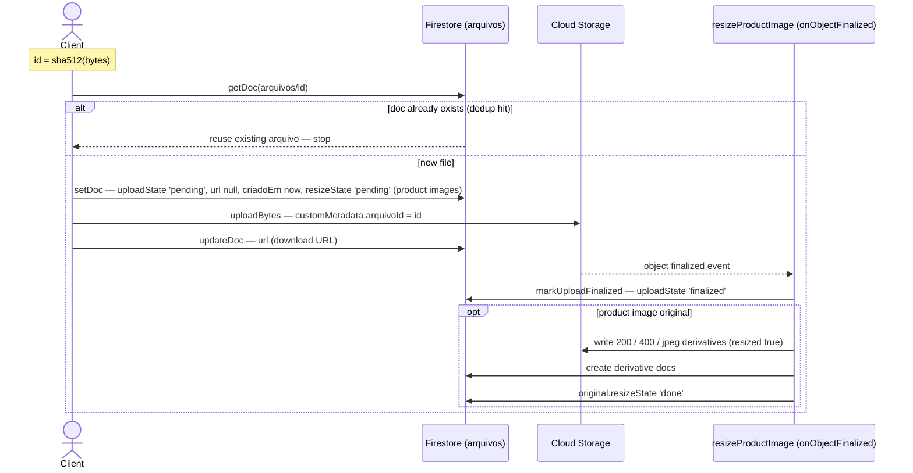
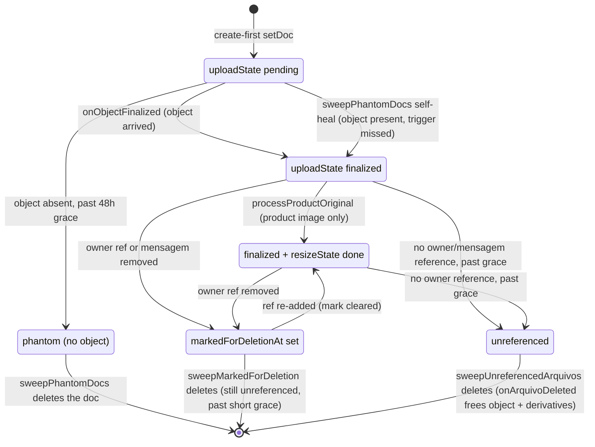
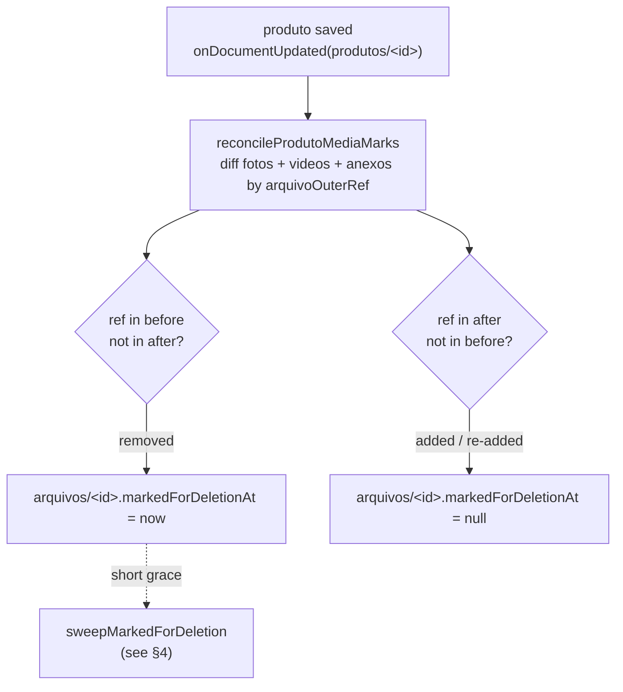
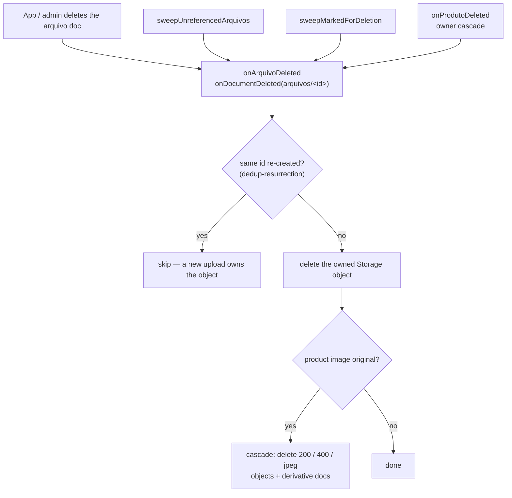

A managerial, high-level view of how files (`arquivos`) move through the system —
**upload → finalize/resize → maintenance → deletion** — and which mechanism covers
each happy path and each failure mode. The design *decisions* live in
[ADR 0010 — Produto deletion lifecycle](/adr/0010-produto-deletion-lifecycle/); this
page is the **map** to verify nothing falls through the cracks.

## The model in one breath

- The **`arquivos` Firestore doc is the anchor**, not the Storage object.
- **Create-first**: the client writes the doc *before* uploading the bytes, so a dead
  upload leaves a detectable *phantom doc*, never an orphan object.
- **Content-addressed**: uploads derive ids from `sha512(bytes)` and reuse an existing
  completed anchor. Namespaces scope the id where ownership differs:
  `<produtoId>_<hash>` for owner media and `chat_<hash>` for new composer uploads.
- **Two ownership modes**: `produtos/` and `tabMedi/` encode one owner in the path;
  `whatsapp/` and `chat/` may be referenced globally by many mensagens and therefore
  require a collection-group refcount before deletion.
- The relevant Cloud Functions in codebase `storage` are:

| Function | Trigger | Job |
| --- | --- | --- |
| `resizeProductImage` | `onObjectFinalized` | Confirm upload (`uploadState→'finalized'`) + generate image derivatives |
| `reconcileProductImages` | `onSchedule` (48h) | Backfill derivatives the trigger never finished |
| `onArquivoDeleted` | `onDocumentDeleted('arquivos/{id}')` | Free the object + cascade derivatives when a doc is deleted |
| `onProdutoMediaChanged` / `onTabMediMediaChanged` | owner updates | **Eagerly mark** owner media removed from a document (clear on re-add) |
| `onMensagemDeleted` | `onDocumentDeleted('chat/{conversaId}/mensagem/{mensagemId}')` | Mark governed mensagem media; never delete a possibly shared arquivo directly |
| `reconcileArquivoOrphans` | `onSchedule` (48h) | Reap marked, phantom and globally unreferenced arquivos |

## Storage layout & doc model

| Kind | Storage path | Doc id | Resized? |
| --- | --- | --- | --- |
| Product image **original** | `produtos/<id>/originals/<hash>.<ext>` | `<id>_<hash>` | ✅ (watched) |
| Image **derivative** | `produtos/<id>/derivatives/<hash>_<key>.jpeg` | `<id>_<hash>_<key>` | server-only (`resized:true`) |
| Product **video** | `produtos/<id>/videos/<hash>.<ext>` | `<id>_<hash>` | ❌ |
| Product **attachment** | `produtos/<id>/anexos/<hash>.<ext>` | `<id>_<hash>` | ❌ |
| Size-chart image | `tabMedi/<id>/originals/<hash>.<ext>` | `<id>_<hash>` | ✅ (watched) |
| WhatsApp inbound media | `whatsapp/<contaId>/<mediaId>` | `wa_<mediaId>` | ❌ |
| Chat composer attachment | `chat/<hash>.<ext>` | `chat_<hash>` (legacy `<hash>` remains valid) | ❌ |
| Generic **media** | `media/<hash>.<ext>` | `<hash>` | ❌ |

Each `arquivos` doc carries two **orthogonal** lifecycle markers plus a queryable
timestamp:

- **`uploadState`**: `pending` → `finalized` (the bytes arrived). Set on every
  non-derivative upload.
- **`resizeState`**: `pending` → `done` (derivatives written). **Product image
  originals only**; `null` for videos / generic media.
- **`criadoEm`**: microseconds since epoch, schema default `nowMicros()` — a required
  numeric field so the sweeps can range-query it for the grace window.
- **`markedForDeletionAt`**: microseconds since epoch, or `null` (the default = not
  marked). Set by owner-media triggers and `onMensagemDeleted`; cleared on re-add
  or when the sweep finds another live reference. The marked sweep range-queries it.

Derivative variants are `200` (200px), `400` (400px), and `jpeg` (full-size re-encode).

## 1 · Upload (create-first) + finalize



Entry points (`packages/storage/src/upload.ts`): `uploadProductImage` (originals →
resized), `uploadProductVideo`, `uploadChatFile` (`chat/`, namespaced doc id), and
`uploadFile` / `uploadFromUrl` (generic `media/`). All route through the same private
create-first core, which does the dedup check, doc-before-bytes write, object metadata,
and post-upload `url` patch.

## 2 · Lifecycle state machine



Videos and generic media stop at **finalized** (they never get `resizeState`). Only
owner image originals reach **resized**. The **marked** path is the eager route for a
removed owner or mensagem ref; the **unreferenced** path is the 48h backstop for
abandoned uploads, deletes, console edits and missed deliveries.

## 3 · Eager marks on reference removal

When a user removes media from a produto and saves, its media array
is rewritten *without* that element — but the `arquivos` doc + Storage object are left
behind. Rather than wait for the 48h sweep to *rediscover* this, an `onDocumentUpdated`
trigger diffs the edit and **marks** the orphaned arquivo immediately. The delete still
happens in a grace-protected sweep, so the mark is reversible — a buggy or bulk save that
drops `fotos` can only *mark* (never instantly destroy) photos.



The trigger writes **only** to `arquivos` docs (never `produtos`), so it can't re-fire
itself. It reads + writes the affected docs in one batched `getAll` + `WriteBatch`, and
touches a doc only when it exists, is genuine owner media (its `filepath` parses to a
governed owner root), and the write actually changes the mark. `onTabMediMediaChanged`
applies the same rule to size-chart photos.

Deleting a mensagem follows the same mark-first principle. `onMensagemDeleted`
extracts the six supported fields (`anexoStorage`, `audio.audio`, `image.image`,
`video.video`, `sticker.sticker`, `genericDocument.genericDocument`), accepts both
`arquivos/<id>` and legacy `documents/arquivos/<id>`, and marks only files whose
`filepath` is exactly `chat` or `whatsapp/<contaId>`. It never deletes directly: the
same arquivo may still be used by another mensagem or conversa.

The final mensagem-media decision is made in an Admin transaction that rereads the
arquivo and repeats the global collection-group refcount query before deleting the
anchor. Inbound and outbound mensagem writers read those arquivo anchors inside their
own write transaction. If a writer commits first, the sweep retries and sees the ref;
if deletion commits first, the writer retries, sees the missing anchor and does not
create a dangling mensagem.

## 4 · Maintenance — scheduled reconciliation (every 48h)

```mermaid
flowchart TD
    Sched[onSchedule · every 48h]

    Sched --> RPI[reconcileProductImages]
    RPI --> RPIQ["query arquivos<br/>where resizeState == 'pending' (limit 100)"]
    RPIQ --> PPO["processProductOriginal<br/>backfill missing 200 / 400 / jpeg derivatives"]

    Sched --> RAO[reconcileArquivoOrphans]

    RAO --> SM[sweepMarkedForDeletion]
    SM --> SMQ["query where markedForDeletionAt &lt; cutoff<br/>orderBy markedForDeletionAt (limit 100)"]
    SMQ --> SMR{still unreferenced?<br/>(owner or global mensagem check)}
    SMR -->|yes| DelM["delete doc → onArquivoDeleted"]
    SMR -->|no, re-added| ClearM["clear mark (markedForDeletionAt = null)"]

    RAO --> SP[sweepPhantomDocs]
    SP --> SPQ["query where uploadState == 'pending'<br/>AND criadoEm &lt; cutoff<br/>orderBy criadoEm (oldest first, limit 100)"]
    SPQ --> SPO{object exists?}
    SPO -->|yes| Heal["self-heal → uploadState 'finalized'"]
    SPO -->|no| DelP[delete phantom doc]

    RAO --> SU[sweepUnreferencedArquivos]
    SU --> FUC["round-robin page by document id<br/>classify old owner vs mensagem media"]
    FUC --> RR["owner: getAll owning docs<br/>mensagem: indexed OR over six fields"]
    RR --> REF{still referenced?}
    REF -->|yes| Keep[keep]
    REF -->|no, mensagem| TX["transaction: reread anchor + repeat global query"]
    REF -->|no, owner| DelU["delete doc → onArquivoDeleted"]
    TX --> DelU
```

Two independent scheduled functions:

- **`reconcileProductImages`** — a *filtered* query (`resizeState == 'pending'`), so it
  scans only originals whose derivatives are missing, never the whole catalog. Shares
  the idempotent `processProductOriginal` with the finalize trigger (writes only what's
  missing, skips the download when complete).
- **`reconcileArquivoOrphans`** — three bounded passes:
  - **`sweepMarkedForDeletion`** — the back half of the eager reap: deletes arquivos
    owner/mensagem triggers marked (`markedForDeletionAt < cutoff`) once they're past a
    **short** grace (`ARQUIVO_MARKED_GRACE_HOURS`, default 1h), re-verifying the owning
    document or global mensagem refs. A missed unmark clears the mark instead. If scope
    cannot be derived from `filepath`, it clears and logs — never deletes blind. Plain
    Admin queries (no Pipelines), so the pass is emulator-testable.
  - **`sweepPhantomDocs`** — a `pending` doc past the grace window whose object never
    arrived is deleted; if the object *is* present (the finalize event was missed), the
    doc self-heals to `finalized`. The selection (pending + past grace + oldest first)
    is entirely in the query, backed by the composite index
    `arquivos(uploadState, criadoEm)`.
  - **`sweepUnreferencedArquivos`** — round-robin pages `arquivos` by document id,
    applies age/scope in code, then checks only the relevant owner documents or performs
    one bounded-concurrency collection-group query per mensagem-media candidate. The
    latter is an OR over all six fields and both ref encodings, limited to one result.
    Its final no-ref verdict is recomputed transactionally before deleting the anchor.

## 5 · Deletion + cascade



Deletion is **doc-anchored**: deleting the `arquivos` doc is what frees Storage, so the
same code path covers an explicit delete, a sweep delete, and the produto-delete
cascade. The dedup-resurrection guard skips the object delete if a doc
with the same content-addressed id exists again (a re-upload recreated it).

## Coverage matrix

| Scenario | Covered? | By what |
| --- | --- | --- |
| Normal upload (image / video / media) | ✅ | create-first + `onObjectFinalized` → `finalized` (+ derivatives for images) |
| Re-upload of identical bytes (dedup) | ✅ | content-addressed id → `putArquivo` reuses the existing doc, no re-upload/re-trigger |
| Client dies **before** the doc write | ✅ | nothing created — no debris |
| Client dies **mid-upload** (doc, no object) | ✅ | phantom doc → `sweepPhantomDocs` deletes after grace |
| Client dies **after upload, before url patch** | ⚠️ partial | `uploadState` still finalizes; `url` stays `null` — product images render via derivative URLs; generic media needs a re-patch (deferred refinement) |
| Finalize event missed / lagged | ✅ | `sweepPhantomDocs` self-heals to `finalized` when the object is present |
| Resize fails / partial derivatives | ✅ | `reconcileProductImages` retries; `processProductOriginal` writes only the missing variants |
| Resize trigger fires twice (race) | ✅ | idempotent — second run sees the derivatives exist and only stamps `done` |
| Photo edited out of a produto | ✅ | **eagerly** marked by `onProdutoMediaChanged` → `sweepMarkedForDeletion` deletes after short grace (re-verified); `sweepUnreferencedArquivos` is the 48h backstop |
| Photo removed then re-added before the sweep | ✅ | the re-add clears `markedForDeletionAt`; even if that unmark is missed, the sweep re-verifies the produto reference and clears instead of deleting |
| Bulk/partial save accidentally drops `fotos` | ✅ guarded | only *marks* (reversible) — the grace window + owner re-verify prevent an instant destructive delete |
| Explicit arquivo delete (app/admin) | ✅ | `onArquivoDeleted` frees object + cascades derivatives |
| Re-upload races a delete (resurrection) | ✅ | dedup-resurrection guard skips the object delete |
| Abandoned WhatsApp inbound / composer upload | ✅ | `whatsapp/` / `chat/` candidate → global refcount → transactional delete |
| Mensagem or conversa deleted | ✅ | `onMensagemDeleted` marks; marked sweep preserves shared refs and deletes after the last ref + grace |
| Same arquivo shared across mensagens/conversas | ✅ | global collection-group refcount; no single-message delete |
| Sweep races a new mensagem | ✅ | both sides read the arquivo anchor transactionally; loser retries against winner |
| **Produto deleted** | ✅ | `onProdutoDeleted` cascades owner media; round-robin sweep remains the backstop |
| Manual Firestore-console produto delete | ✅ eventual | owner becomes missing; the round-robin sweep reaps its old media |

## Indexes & cost

This project runs Firestore **Enterprise**, which **auto-creates no indexes**. The
index-dependent sweep queries are declared in `firestore.indexes.json` and must be
deployed manually:

- `arquivos(uploadState, criadoEm)` — the phantom sweep (equality + range + orderBy).
- `arquivos(markedForDeletionAt)` — the marked sweep (range + sort; `null` docs are
  excluded by the range predicate).
- Six single-field, `COLLECTION_GROUP` indexes on `mensagem`: `anexoStorage`,
  `audio.audio`, `image.image`, `video.video`, `sticker.sticker`, and
  `genericDocument.genericDocument`. The OR refcount query depends on all six.

All three sweeps are bounded at **100 docs/run**. Grace windows:
`ARQUIVO_ORPHAN_GRACE_HOURS` (48h) for the phantom + unreferenced passes;
`ARQUIVO_MARKED_GRACE_HOURS` (1h) for the marked pass. The round-robin page uses native
document-id ordering and needs no declared index. Owner refchecks use `getAll` only for
the distinct owners in the page. Mensagem refchecks run with concurrency 8 and
`limit(1)`; only candidates that look unreferenced pay the second transactional query.

`packages/schemas/src/mensagemArquivoRefs.indexes.test.ts` keeps the field inventory and
index declarations synchronized. `apps/functions/scripts/check-sweep-indexes.mjs` runs
`explain({ analyze: true })` against the named `default` database, logs
`indexesUsed`/read/scan metrics, and fails if the live plan does not use all six indexes.
The emulator cannot run Query Explain; this check belongs to the coordinated deployment
runbook, after indexes reach `READY`.

## Known gaps & follow-ups

- **#135 — reference cascade (Phase 3, blocked).** Replace the produto delete-*block* with
  a confirmed cascade (kit entries, marketplace variation links, remote delist) — blocked
  on the `apps/integrations` remote-delist design.

## See also

- [ADR 0010 — Produto deletion lifecycle](/adr/0010-produto-deletion-lifecycle/) — the design decisions behind this lifecycle.
- `apps/functions/CLAUDE.md` — operational notes for the functions + deploy gotchas.
- Source: `packages/storage/src/upload.ts`, `apps/functions/src/arquivos/*`,
  `apps/functions/src/product-images/*`, `packages/schemas/src/mensagemArquivoRefs.ts`,
  `packages/schemas/src/storage/{arquivo,storagePaths}.ts`.
