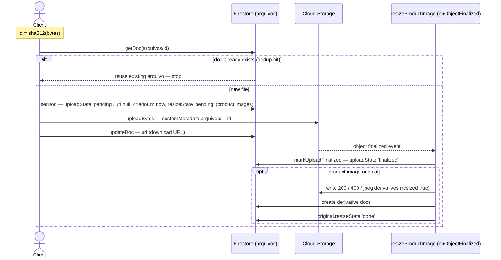
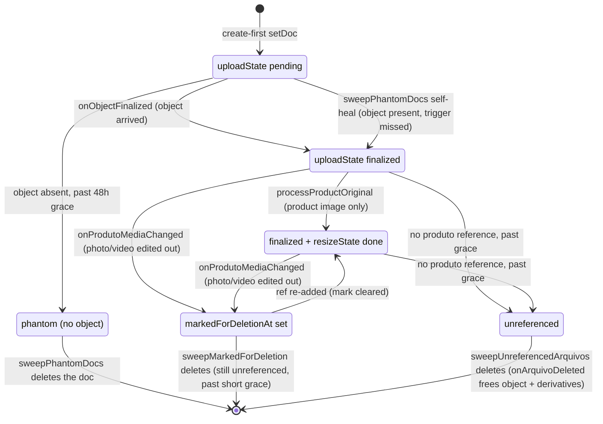
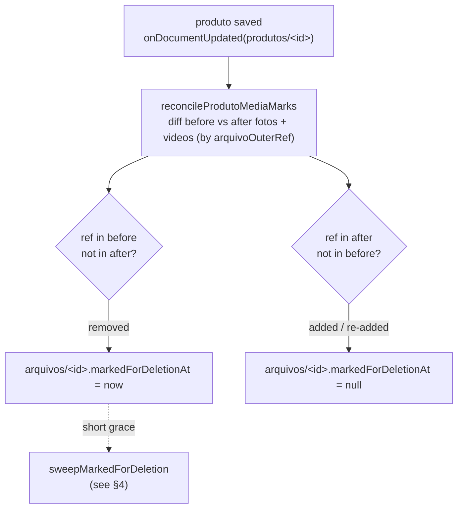
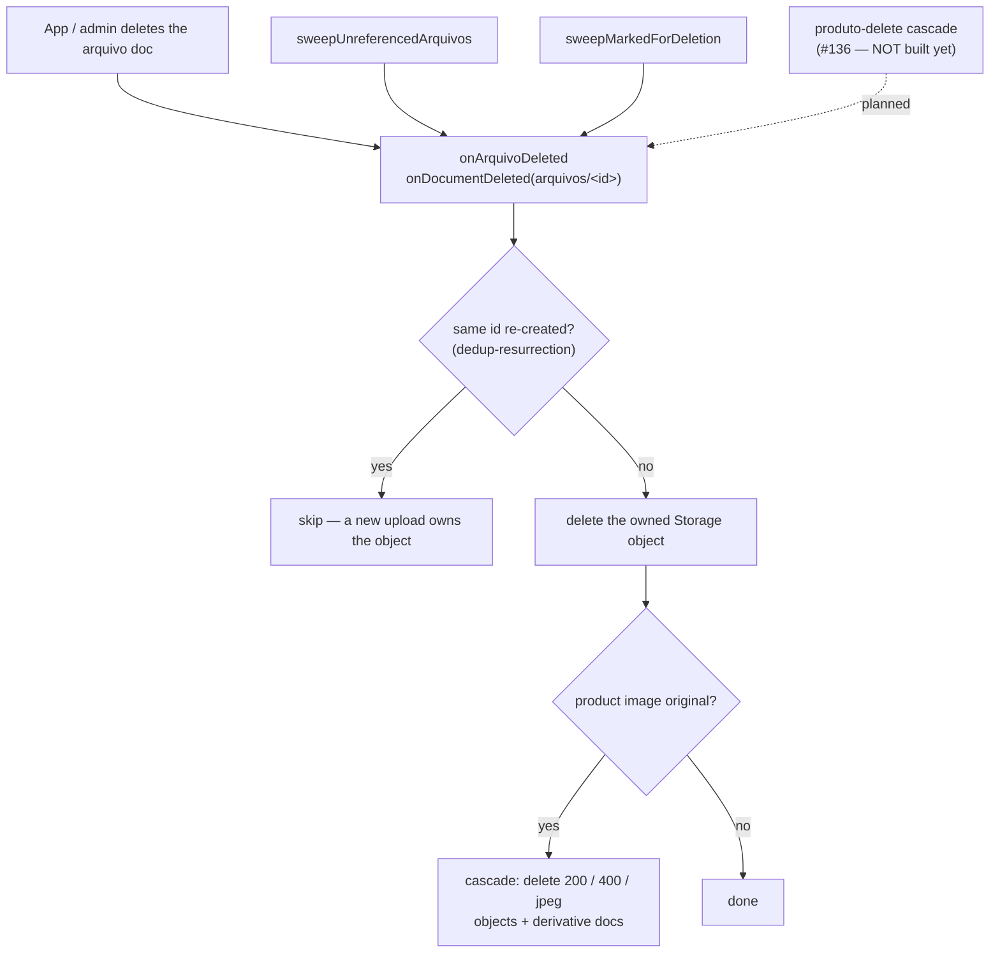

A managerial, high-level view of how files (`arquivos`) move through the system —
**upload → finalize/resize → maintenance → deletion** — and which mechanism covers
each happy path and each failure mode. The design *decisions* live in
[ADR 0010 — Produto deletion lifecycle](/adr/0010-produto-deletion-lifecycle/); this
page is the **map** to verify nothing falls through the cracks.

## The model in one breath

- The **`arquivos` Firestore doc is the anchor**, not the Storage object.
- **Create-first**: the client writes the doc *before* uploading the bytes, so a dead
  upload leaves a detectable *phantom doc*, never an orphan object.
- **Content-addressed**: the doc id is `sha512(bytes)` — re-uploading identical bytes
  is a no-op (dedup).
- **Product-scoped**: every product file lives under `produtos/<produtoId>/…` with a
  product-scoped doc id, so there is no cross-product sharing — deletion is
  owner-scoped and needs no refcount table.
- Five Cloud Functions own the server side (codebase `storage`, region `us-east5`):

| Function | Trigger | Job |
| --- | --- | --- |
| `resizeProductImage` | `onObjectFinalized` | Confirm upload (`uploadState→'finalized'`) + generate image derivatives |
| `reconcileProductImages` | `onSchedule` (48h) | Backfill derivatives the trigger never finished |
| `onArquivoDeleted` | `onDocumentDeleted('arquivos/{id}')` | Free the object + cascade derivatives when a doc is deleted |
| `onProdutoMediaChanged` | `onDocumentUpdated('produtos/{id}')` | **Eagerly mark** an arquivo for deletion when a photo/video is edited out of a produto (clears the mark on re-add) |
| `reconcileArquivoOrphans` | `onSchedule` (48h) | Delete marked arquivos + reap phantom docs + arquivos no produto references anymore |

## Storage layout & doc model

| Kind | Storage path | Doc id | Resized? |
| --- | --- | --- | --- |
| Product image **original** | `produtos/<id>/originals/<hash>.<ext>` | `<id>_<hash>` | ✅ (watched) |
| Image **derivative** | `produtos/<id>/derivatives/<hash>_<key>.jpeg` | `<id>_<hash>_<key>` | server-only (`resized:true`) |
| Product **video** | `produtos/<id>/videos/<hash>.<ext>` | `<id>_<hash>` | ❌ |
| Generic **media** | `media/<hash>.<ext>` | `<hash>` | ❌ |

Each `arquivos` doc carries two **orthogonal** lifecycle markers plus a queryable
timestamp:

- **`uploadState`**: `pending` → `finalized` (the bytes arrived). Set on every
  non-derivative upload.
- **`resizeState`**: `pending` → `done` (derivatives written). **Product image
  originals only**; `null` for videos / generic media.
- **`criadoEm`**: microseconds since epoch, schema default `nowMicros()` — a required
  numeric field so the sweeps can range-query it for the grace window.
- **`markedForDeletionAt`**: microseconds since epoch, or `null` (the default = not
  marked). Set by `onProdutoMediaChanged` when an edit removes the arquivo's ref;
  cleared back to `null` on re-add. The marked sweep range-queries it.

Derivative variants are `200` (200px), `400` (400px), and `jpeg` (full-size re-encode).

## 1 · Upload (create-first) + finalize



Entry points (`packages/storage/src/upload.ts`): `uploadProductImage` (originals →
resized), `uploadProductVideo`, `uploadFile` / `uploadFromUrl` (generic `media/`). All
route through `putArquivo`, which does the dedup check, the doc-before-bytes write, and
the post-upload `url` patch.

## 2 · Lifecycle state machine



Videos and generic media stop at **finalized** (they never get `resizeState`). Only
product image originals reach **resized**. The **marked** path is the eager route for
a photo edited out of a produto; the **unreferenced** path is the 48h backstop for
everything the trigger misses (produto deletes, console edits, missed deliveries).

## 3 · Eager reap on produto edit (`onProdutoMediaChanged`)

When a user removes a photo/video from a produto and saves, the `fotos`/`videos` array
is rewritten *without* that element — but the `arquivos` doc + Storage object are left
behind. Rather than wait for the 48h sweep to *rediscover* this, an `onDocumentUpdated`
trigger diffs the edit and **marks** the orphaned arquivo immediately. The delete still
happens in a grace-protected sweep, so the mark is reversible — a buggy or bulk save that
drops `fotos` can only *mark* (never instantly destroy) photos.



The trigger writes **only** to `arquivos` docs (never `produtos`), so it can't re-fire
itself. It reads + writes the affected docs in one batched `getAll` + `WriteBatch`, and
touches a doc only when it exists, is **genuine product media** (its `filepath` parses to
`produtos/<id>/originals|videos` — a `fotos` ref pointing elsewhere is skipped, since the
sweep couldn't owner-verify it), and the write actually changes the mark (no no-op
writes). `anexos` are intentionally out of scope (their files aren't under
`originals|videos`); they stay on the 48h backstop.

## 4 · Maintenance — scheduled reconciliation (every 48h)

```mermaid
flowchart TD
    Sched[onSchedule · every 48h]

    Sched --> RPI[reconcileProductImages]
    RPI --> RPIQ["query arquivos<br/>where resizeState == 'pending' (limit 100)"]
    RPIQ --> PPO["processProductOriginal<br/>backfill missing 200 / 400 / jpeg derivatives"]

    Sched --> RAO[reconcileArquivoOrphans]

    RAO --> SM[sweepMarkedForDeletion]
    SM --> SMQ["query where markedForDeletionAt &lt; cutoff<br/>orderBy markedForDeletionAt (limit 100)"]
    SMQ --> SMR{still unreferenced?<br/>(re-verify owner produto)}
    SMR -->|yes| DelM["delete doc → onArquivoDeleted"]
    SMR -->|no, re-added| ClearM["clear mark (markedForDeletionAt = null)"]

    RAO --> SP[sweepPhantomDocs]
    SP --> SPQ["query where uploadState == 'pending'<br/>AND criadoEm &lt; cutoff<br/>orderBy criadoEm (oldest first, limit 100)"]
    SPQ --> SPO{object exists?}
    SPO -->|yes| Heal["self-heal → uploadState 'finalized'"]
    SPO -->|no| DelP[delete phantom doc]

    RAO --> SU[sweepUnreferencedArquivos]
    SU --> FUC["fetchUnreferencedCandidates — regex pipeline:<br/>filepath ~ produtos/&lt;id&gt;/originals or /videos<br/>AND criadoEm &lt; cutoff, oldest first (limit 100)"]
    FUC --> RR["resolveReferencedArquivoRefs<br/>getAll owning produtos → fotos / videos / anexos refs"]
    RR --> REF{referenced by<br/>its produto?}
    REF -->|yes| Keep[keep]
    REF -->|no| DelU["delete doc → onArquivoDeleted"]
```

Two independent scheduled functions:

- **`reconcileProductImages`** — a *filtered* query (`resizeState == 'pending'`), so it
  scans only originals whose derivatives are missing, never the whole catalog. Shares
  the idempotent `processProductOriginal` with the finalize trigger (writes only what's
  missing, skips the download when complete).
- **`reconcileArquivoOrphans`** — three bounded passes:
  - **`sweepMarkedForDeletion`** — the back half of the eager reap: deletes arquivos
    `onProdutoMediaChanged` marked (`markedForDeletionAt < cutoff`) once they're past a
    **short** grace (`ARQUIVO_MARKED_GRACE_HOURS`, default 1h), **re-verifying** the owning
    produto still doesn't reference them (a missed unmark clears the mark instead). If the
    owner can't be derived from the `filepath` (legacy/bad data), it clears the mark and
    logs — it never deletes what it can't verify. A plain indexed range query (no
    pipeline), so it's the cheapest pass and runs first.
  - **`sweepPhantomDocs`** — a `pending` doc past the grace window whose object never
    arrived is deleted; if the object *is* present (the finalize event was missed), the
    doc self-heals to `finalized`. The selection (pending + past grace + oldest first)
    is entirely in the query, backed by the composite index
    `arquivos(uploadState, criadoEm)`.
  - **`sweepUnreferencedArquivos`** — product photos/videos that **no produto
    references anymore** (e.g. a photo edited out of `produto.fotos`). Candidates come
    from a **regex pipeline** scoped server-side to `originals|videos`; each candidate's
    owner `produtoId` is parsed from its path, and only the owning produtos are read
    (`getAll`, field-masked to `fotos`/`videos`/`anexos`) — **O(distinct produtos in the
    batch)**, never O(all produtos). Deleting the doc lets `onArquivoDeleted` free the
    object and its derivatives.

## 5 · Deletion + cascade



Deletion is **doc-anchored**: deleting the `arquivos` doc is what frees Storage, so the
same code path covers an explicit delete, a sweep delete, and (in future) a
produto-delete cascade. The dedup-resurrection guard skips the object delete if a doc
with the same content-addressed id exists again (a re-upload recreated it).

## Coverage matrix

| Scenario | Covered? | By what |
| --- | --- | --- |
| Normal upload (image / video / media) | ✅ | create-first + `onObjectFinalized` → `finalized` (+ derivatives for images) |
| Re-upload of identical bytes (dedup) | ✅ | content-addressed id → `putArquivo` reuses the existing doc, no re-upload/re-trigger |
| Client dies **before** the doc write | ✅ | nothing created — no debris |
| Client dies **mid-upload** (doc, no object) | ✅ | phantom doc → `sweepPhantomDocs` deletes after grace |
| Client dies **after upload, before url patch** | ⚠️ partial | `uploadState` still finalizes; `url` stays `null` — product images render via derivative URLs; generic media needs a re-patch (deferred refinement) |
| Finalize event missed / lagged | ✅ | `sweepPhantomDocs` self-heals to `finalized` when the object is present |
| Resize fails / partial derivatives | ✅ | `reconcileProductImages` retries; `processProductOriginal` writes only the missing variants |
| Resize trigger fires twice (race) | ✅ | idempotent — second run sees the derivatives exist and only stamps `done` |
| Photo edited out of a produto | ✅ | **eagerly** marked by `onProdutoMediaChanged` → `sweepMarkedForDeletion` deletes after short grace (re-verified); `sweepUnreferencedArquivos` is the 48h backstop |
| Photo removed then re-added before the sweep | ✅ | the re-add clears `markedForDeletionAt`; even if that unmark is missed, the sweep re-verifies the produto reference and clears instead of deleting |
| Bulk/partial save accidentally drops `fotos` | ✅ guarded | only *marks* (reversible) — the grace window + owner re-verify prevent an instant destructive delete |
| Explicit arquivo delete (app/admin) | ✅ | `onArquivoDeleted` frees object + cascades derivatives |
| Re-upload races a delete (resurrection) | ✅ | dedup-resurrection guard skips the object delete |
| **Produto deleted** | ⚠️ delayed | no produto-delete trigger yet (#136) — the produto's arquivos become unreferenced and are reaped by the 48h sweep, not immediately |
| Manual Firestore-console produto delete | ⚠️ delayed | same as above — eventual cleanup via the sweep, no real-time block |

## Indexes & cost

This project runs Firestore **Enterprise**, which **auto-creates no indexes**, so both
sweep queries are declared in `firestore.indexes.json` and must be deployed
(`firebase deploy --only firestore:indexes`):

- `arquivos(uploadState, criadoEm)` — the phantom sweep (equality + range + orderBy).
- `arquivos(criadoEm)` — the unreferenced candidate pipeline (range + sort; the regex is
  a residual filter).
- `arquivos(markedForDeletionAt)` — the marked sweep (range + sort; `null` docs are
  excluded by the range predicate).

All three sweeps are bounded at **100 docs/run**. Grace windows:
`ARQUIVO_ORPHAN_GRACE_HOURS` (48h) for the phantom + unreferenced passes;
`ARQUIVO_MARKED_GRACE_HOURS` (1h) for the marked pass. The unreferenced sweep's read
cost is the candidate batch plus one `getAll` over the *distinct* owning produtos — not
the whole `produtos` collection; the marked sweep's reference re-check shares that
`getAll`-by-owner lookup. The `onProdutoMediaChanged` trigger itself is O(media delta) —
one batched read + write per edit, and zero when the edit doesn't touch media.

## Known gaps & follow-ups

- **#136 — produto-_delete_ cascade (not built).** `onProdutoMediaChanged` handles the
  produto-_edit_ case (a photo removed from a live produto); its sibling, an
  `onDocumentDeleted('produtos/{id}')` function, would handle a produto deleted *entirely*
  — sweeping its 13 subcollections and deleting its referenced arquivos docs *promptly*.
  Until it ships, a deleted produto's arquivos linger until the 48h unreferenced sweep
  reaps them. This is the next planned step (ADR 0010 Phase 1).
- **#234 — persisted-cursor coverage.** Both sweeps re-read the oldest docs each run, so a
  large head of long-lived referenced photos can starve newer orphans; a persisted
  round-robin cursor is the planned fix.
- **#135 — reference cascade (Phase 3, blocked).** Replace the produto delete-*block* with
  a confirmed cascade (kit entries, marketplace variation links, remote delist) — blocked
  on the `apps/integrations` remote-delist design.

## See also

- [ADR 0010 — Produto deletion lifecycle](/adr/0010-produto-deletion-lifecycle/) — the design decisions behind this lifecycle.
- `apps/functions/CLAUDE.md` — operational notes for the five functions + deploy gotchas.
- Source: `packages/storage/src/upload.ts`, `apps/functions/src/arquivos/*`, `apps/functions/src/product-images/*`, `packages/schemas/src/storage/{arquivo,storagePaths}.ts`.
