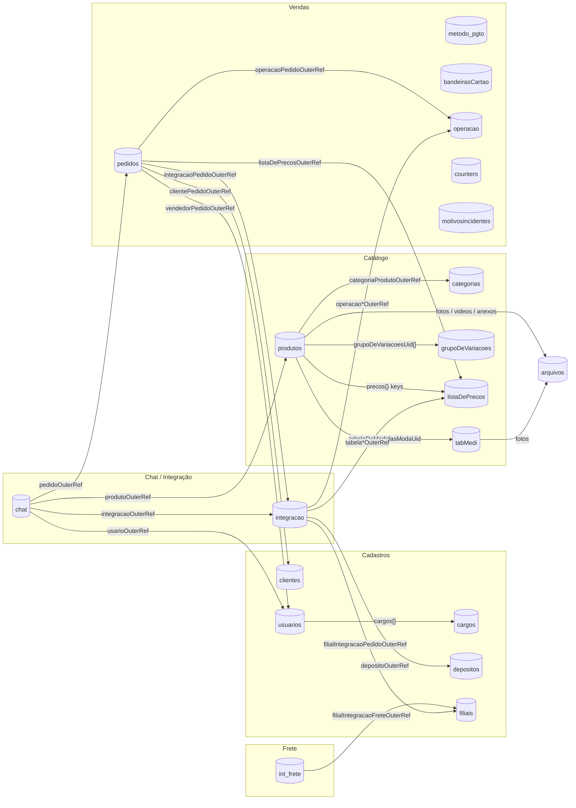
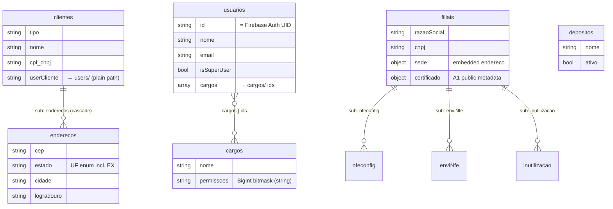
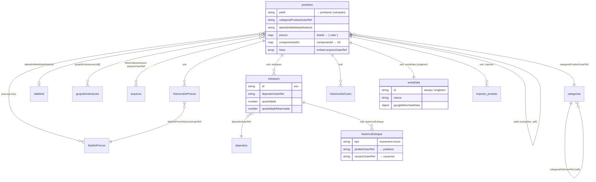
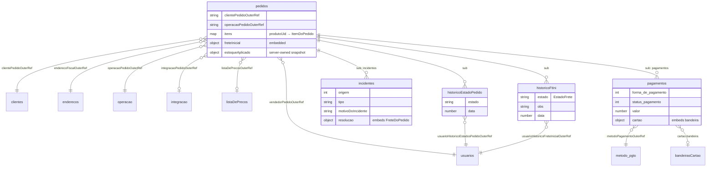
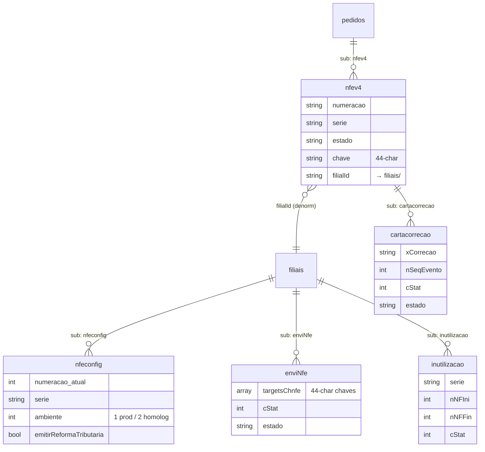
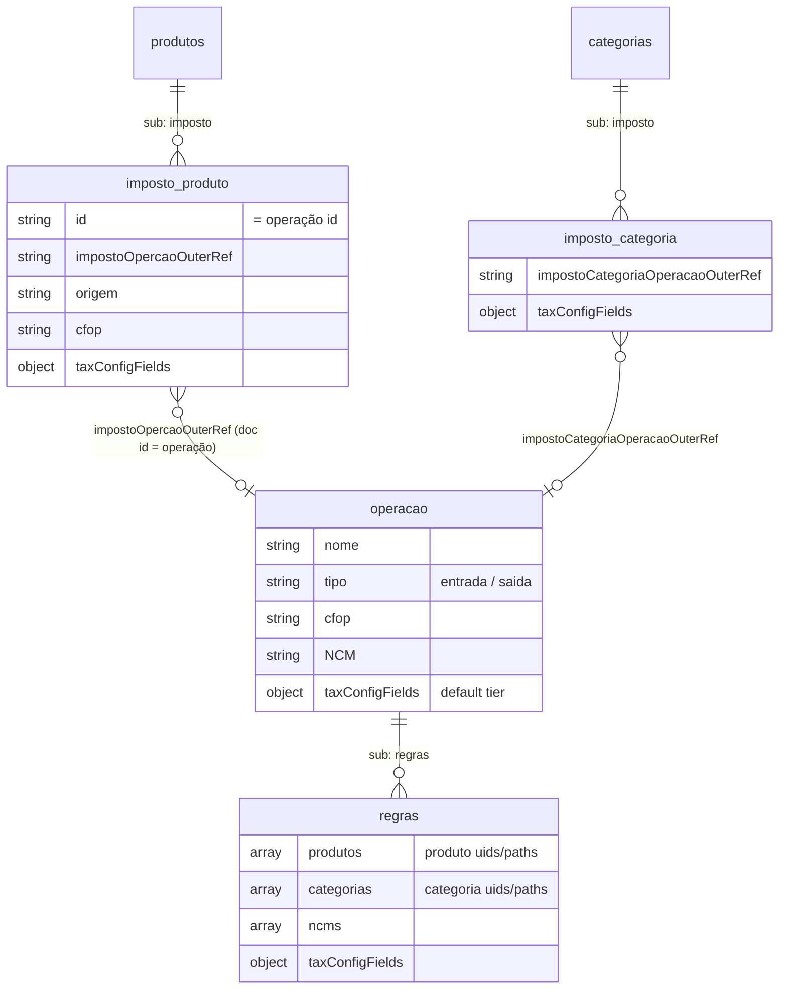
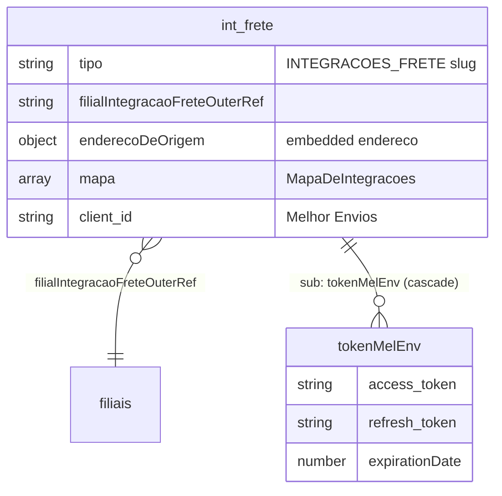
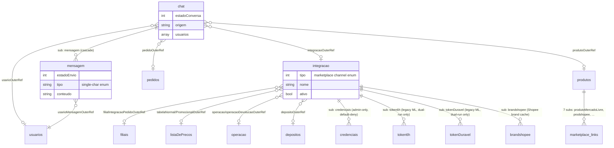

The entire data model lives in **`packages/schemas/src/`**: a Zod schema plus a
`CollectionMetadata` object per domain, registered in
[`registry.ts`](https://github.com/) `ALL_DOMAINS`. That registry is the single
source of truth — the Firestore rules generator walks it, the data layer resolves
collection paths from it, and this page is drawn from it. If a diagram here ever
disagrees with `packages/schemas`, **the schema wins** — update the diagram.

There are **55 registered collection domains** (48 named + the 7 marketplace-link
produto subcollections spread in via `PRODUTO_SUBCOLLECTION_DOMAINS`). This page
groups them into seven functional areas, each with its own ER diagram, preceded
by a high-level map.

Four of those 48 are **dual-run only** — legacy Mercado Livre collections the new
app reaches solely through the Admin SDK, registered so the generated ruleset does
not strip access the still-running Flutter client has today. They come back out
with the Flutter decommission (#829); see
[Legacy ruleset coverage](/architecture/legacy-rules-coverage/).

## How to read these diagrams

A few conventions from the schema layer decide what the edges mean.

**Collection paths.** `meta.collectionPath` is the Firestore path.
Top-level collections are a single segment (`clientes`, `produtos`); subcollections
use `{parentId}` placeholders resolved at runtime
(`clientes/{clienteId}/enderecos`,
`pedidos/{pedidoId}/nfev4/{nfeId}/cartacorrecao`). In the diagrams a subcollection
edge is drawn `PARENT ||--o{ CHILD : "sub: <path segment>"`.

**References are doc-path strings, not native references.** Cross-collection links
are stored as strings, never Firestore `reference` values — the format the legacy
Flutter app reads and writes (see
[`shared/outerRef.ts`](https://github.com/)). Two wire forms exist, both string:

- `*OuterRef` / `*OuterReference` → canonical `documents/<col>/<id>`
  (subcollection paths allowed).
- imposto scope refs and media `arquivoOuterRef` → bare `<col>/<id>`.

No `*OuterRef` is ever used in a Firestore `where()` — every consumer dereferences
the path app-side — so a native reference would buy nothing and only fragment the
data. In the diagrams a reference edge is labelled with the **field name** that
holds it.

**Multi-tenancy is by field, not by path.** There is no per-tenant path prefix;
isolation is enforced by document fields (`grupoEconomico`, `userCliente`, …)
inside the generated Firestore rules, to preserve parity with the Flutter data.

**Cascade.** `meta.cascade` declares which subcollections are deleted with the
parent (`onDelete: 'cascade'`) or block its deletion when non-empty
(`onDelete: 'restrict'`). It is also the most reliable enumeration of a
collection's real subcollections.

**Cardinality legend** (crow's-foot, as mermaid draws it):

- `||--o{` — one parent, zero-or-many children (a subcollection).
- `}o--||` — many docs each referencing exactly one target (a required ref).
- `}o--o|` — many docs each referencing at most one target (a nullable ref).
- `}o--o{` — many-to-many (an array of ids, e.g. `usuarios.cargos[]`).

## Overview map

Top-level collections grouped by functional area, with the principal reference
edges between them. Subcollections are omitted here for legibility — see the
per-area diagrams below. Cylinders are Firestore collections.

## Cadastros core

Master data: customers and their addresses, users and their roles, warehouses,
and fiscal branches (each branch owns its NF-e config and audit subcollections).
`enderecoSchema` is also **embedded** inside `filiais.sede` and
`int_frete.enderecoDeOrigem` (not a reference — a copy).

## Catálogo / Produto

`produtos` is the hub of the catalog. Variation children are ordinary `produtos`
docs pointing at their parent via `paiId` (the catalog list filters `paiId == null`
to show parents only). Categories form their own hierarchy through
`categoriaPaiOuterRef`. The rich per-product state — stock, price/cost history,
marketing extras, tax config — lives in subcollections.

## Vendas / Pedido

A `pedidos` doc references the customer, the delivery address, the salesperson,
the fiscal operation, the sales channel and the price list. Line items, the
initial freight block and the applied-stock snapshot are **embedded** on the doc;
payments, incidents and the two state-change logs are subcollections — one for the
pedido `estado`, one for the embedded `freteInicial.estado`. `estoqueAplicado`
is a `serverOwnedFields` snapshot — the client may never write it.

`counters` (the `pedido` numbering singleton) and `motivosincidentes` (incident
reason catalog) are standalone top-level collections gated by the `pedido`
permission bits.

## Fiscal / NF-e

The NF-e document lives **under** its pedido at `pedidos/{pedidoId}/nfev4` and is
read-only in the Next UI (Cloud Functions own its lifecycle). It carries a
denormalized `filialId` for collection-group scoping. Correction letters (CC-e)
are appended in a fourth-level subcollection. Each `filiais` doc owns the
numbering config and the SEFAZ round-trip audit logs.

## Imposto / tax resolver

Tax configuration is resolved across three tiers, all pointing at `operacao`
(the fiscal operation carrying the default tax tier). The per-product and
per-category `imposto` subcollections keep their **legacy collection id `imposto`**;
their matching rules live in `operacao/{id}/regras`. Both `imposto` leaves and the
`regras` leaf share the same tribute-config shape (`taxConfigFields`).

## Frete

Freight integrations are configured in `int_frete`, discriminated by `tipo`
(the `INTEGRACOES_FRETE` slug). Each config belongs to a fiscal branch and, for
Melhor Envios, owns an OAuth-token subcollection whose reads require the freight
**write** bit. A pedido's chosen freight is **embedded** as `freteInicial`
(a `FreteDoPedido`) — not a subcollection reference.

## Chat / Integração / Marketplace

`chat` conversations reference the user, channel, pedido and produto they concern,
with messages in a subcollection. `integracao` (a sales channel) references the
branch, price lists, operations and warehouse it maps to. Its **credential**
subcollections `credenciais` and `credenciaisWhatsapp` are deliberately **not
registered** in `ALL_DOMAINS`, so the rules generator emits no match block and
Firestore default-denies them — they are Admin-SDK-only. Its `brandshopee`
subcollection (Shopee brand-cache docs) IS registered, gated by the same
`integracao` permissions. Each `produtos` doc also carries the seven
marketplace-link subcollections (loose pass-through, written by Flutter).

⚠️ The legacy Mercado Livre token stores `token6h` and `tokenDuravel` are the one
exception to that deny-all posture. They **are** registered, on the `integracao`
permission bits, because the Flutter client writes them from its OAuth connect
screen and reads `tokenDuravel` on every ML action screen — leaving them out would
retire the Flutter ML UI the day the generated ruleset deploys (#783). The grant
makes a live ML `refresh_token` client-readable, matching what the deployed legacy
ruleset already does, and is reverted by #829. The same issue covers the two other
dual-run registrations, `notificacoesMercadoLivre` and top-level `questionsML`.

## Legacy naming caveats

Several collection ids and field names carry **deliberate typos / mismatches**
preserved for Flutter coexistence. Do not "fix" them — the wire format is shared
with the deployed Flutter app:

| Where | Kept as | Note |
| --- | --- | --- |
| `produtos/{}/imposto`, `categorias/{}/imposto` | collection id `imposto` | not the domain name |
| `operacao/{}/regras` | collection id `regras` | not the domain name |
| impostoProduto field | `impostoOpercaoOuterRef` | typo: "Opercao" |
| conversa / mensagem fields | `usarioOuterRef`, `usarioMensagemOuterRef` | typo: "usario" |
| frete embed fields | `clienteRecebedorOuterReference`, `enderecoFreteOuterReference` | full "Reference" suffix |
| produto field | `tabelaDeMedidasModaUid` | plain path string validated as an OuterRef |

## Collection reference

Every registered domain, its Firestore path, whether it is top-level or a
subcollection, and its key outgoing references. Subcollection paths use
`{parentId}` placeholders.

| Domain | Path | Level | Key outgoing refs |
| --- | --- | --- | --- |
| cliente | `clientes` | top | `userCliente` → users |
| endereco | `clientes/{clienteId}/enderecos` | sub | — |
| produto | `produtos` | top | `categoriaProdutoOuterRef`, `tabelaDeMedidasModaUid`, `paiId`, `grupoDeVariacoesUid[]`, `precos{}`, `arquivoOuterRef` |
| produtoMercadoLivre | `produtos/{produtoId}/produtoMercadoLivre` | sub | pass-through |
| variacaoMercadoLivre | `produtos/{produtoId}/variacaoMercadoLivre` | sub | pass-through |
| produtoShopee | `produtos/{produtoId}/prodshopee` | sub | pass-through |
| variacaoShopee | `produtos/{produtoId}/variashopee` | sub | pass-through |
| produtoMagalu | `produtos/{produtoId}/produtoMagalu2` | sub | pass-through |
| produtoAmazon | `produtos/{produtoId}/prodAmazon` | sub | pass-through |
| produtoLojaIntegrada | `produtos/{produtoId}/produtolojaintegrada` | sub | pass-through |
| estoqueProduto | `produtos/{produtoId}/estoques` | sub | `depositoOuterRef` → depositos |
| historicoEstoque | `produtos/{produtoId}/estoques/{estoqueId}/historicoEstoque` | sub | `pedidoOuterRef`, `usuarioOuterRef` |
| historicoPreco | `produtos/{produtoId}/historicoDePrecos` | sub | `listaDePrecoHistoricoOuterRef` → listaDePrecos |
| historicoCusto | `produtos/{produtoId}/historicoDeCusto` | sub | — |
| produtoExtraData | `produtos/{produtoId}/extraData` | sub | — |
| impostoProduto | `produtos/{produtoId}/imposto` | sub | `impostoOpercaoOuterRef` → operacao |
| categoria | `categorias` | top | `categoriaPaiOuterRef` → categorias (self) |
| impostoCategoria | `categorias/{categoriaId}/imposto` | sub | `impostoCategoriaOperacaoOuterRef` → operacao |
| pedido | `pedidos` | top | `clientePedidoOuterRef`, `enderecoFiscalOuterRef`, `vendedorPedidoOuterRef`, `operacaoPedidoOuterRef`, `integracaoPedidoOuterRef`, `listaDePrecosOuterRef` |
| pagamento | `pedidos/{pedidoId}/pagamentos` | sub | `metodoPagamentoOuterRef` → metodo_pgto |
| incidente | `pedidos/{pedidoId}/incidentes` | sub | — |
| historicoEstadoPedido | `pedidos/{pedidoId}/historicoEstadoPedido` | sub | `usuarioHistoricoEstadosPedidoOuterRef` |
| historicoFtIni | `pedidos/{pedidoId}/historicoFtIni` | sub | `usuarioHistoricoFreteInicialOuterRef` |
| nfe | `pedidos/{pedidoId}/nfev4` | sub | `filialId` → filiais |
| cartaCorrecao | `pedidos/{pedidoId}/nfev4/{nfeId}/cartacorrecao` | sub | — |
| metodoPagamento | `metodo_pgto` | top | — |
| bandeiraCartao | `bandeirasCartao` | top | — |
| counter | `counters` | top | — |
| motivoIncidente | `motivosincidentes` | top | — |
| operacao | `operacao` | top | — |
| regraImposto | `operacao/{operacaoId}/regras` | sub | `produtos[]`, `categorias[]`, `ncms[]` (match arrays) |
| conversa | `chat` | top | `usarioOuterRef`, `integracaoOuterRef`, `pedidoOuterRef`, `produtoOuterRef`, incidente |
| mensagem | `chat/{conversaId}/mensagem` | sub | `usarioMensagemOuterRef` → usuarios |
| integracao | `integracao` | top | `filialIntegracaoPedidoOuterRef`, `tabelaNormal/PromocionalOuterRef`, `operacao/operacaoDevolucaoOuterRef`, `depositoOuterRef` |
| brandShopee | `integracao/{integracaoId}/brandshopee` | sub | pass-through (Shopee brand cache, gated by `integracao` perms) |
| cargo | `cargos` | top | — |
| usuario | `usuarios` | top | `cargos[]` → cargos |
| deposito | `depositos` | top | — |
| grupoDeVariacoes | `grupoDeVariacoes` | top | — |
| tabelaDeMedidas | `tabMedi` | top | `arquivoOuterRef` → arquivos |
| listaDePrecos | `listaDePrecos` | top | — |
| filial | `filiais` | top | — |
| nfeConfig | `filiais/{filialId}/nfeconfig` | sub | — |
| enviNfeMsg | `filiais/{filialId}/enviNfe` | sub | — |
| inutNumeracao | `filiais/{filialId}/inutilizacao` | sub | — |
| intFrete | `int_frete` | top | `filialIntegracaoFreteOuterRef` → filiais |
| tokenMelEnv | `int_frete/{intFreteId}/tokenMelEnv` | sub | — |
| arquivo | `arquivos` | top | — |
| token6h ⚠️ | `integracao/{integracaoId}/token6h` | sub | — |
| tokenDuravel ⚠️ | `integracao/{integracaoId}/tokenDuravel` | sub | — |
| notificacaoMercadoLivre ⚠️ | `notificacoesMercadoLivre` | top | — |
| questionMercadoLivre ⚠️ | `questionsML` | top | `contaMercadoLivreQuestionOuterRef` → integracao |

⚠️ = **dual-run only**, removed by #829. See the Mercado Livre note above.

Collections intentionally **absent** from `ALL_DOMAINS` so the rules generator
default-denies them (Admin-SDK-only): `integracao/{}/credenciais`,
`integracao/{}/credenciaisWhatsapp`, `metodo_pgto/{}/credenciais`,
`filiais/{}/certificadoSecreto`, and the Mercado Pago / WhatsApp notification
logs. The full picture of what the generated ruleset does and does not grant,
measured against the legacy Flutter ruleset, is in
[Legacy ruleset coverage](/architecture/legacy-rules-coverage/).

## See also

- [Data layer](/guides/data-layer/) — `defineCollection`, cascade runtime, how the
  framework reads/writes without codegen.
- [ADR 0003 — Firestore rules generator](/adr/0003-firestore-rules-generator/)
- [ADR 0010 — Produto deletion lifecycle](/adr/0010-produto-deletion-lifecycle/)
- [Arquivo lifecycle](/architecture/arquivo-lifecycle/) — the storage/media model.
- Source: `packages/schemas/src/registry.ts`, `types.ts`, `shared/outerRef.ts`.
